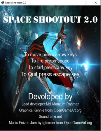

<h1>Space Shootout 2.0</h1>

Hi there! I am Md. Manzum Rahman. I am reading in class 7 at Faujdarhat Cadet College .

Space Shoototut 2.0 is the first game that I have developed learning game development from Youtube. Space Shootout 2.0 is created with python. Pygame is the library used in it. It is basically a 2 dimensional Space Shooting Game .

Happy gaming!🙂

<a href="https://mega.nz/file/nYkHGRaK#1r4Vx-pXB7TEtpI1SpDxihf1xoJS2_YmMd9-zT0G6b0">
    
<button style="background-color: #40ff00; color: white;"><b>Download</b></button>

</a>

<a href="mailto:manzumrahman@gmail.com">
    
<button style="background-color: blue; color: white;"><b>Mail Me</b></button>

</a>

